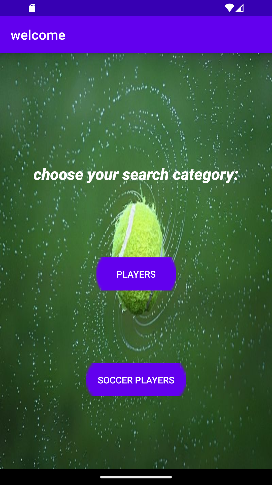
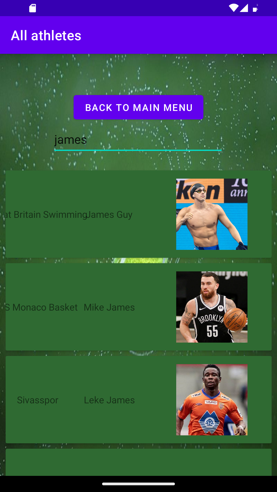
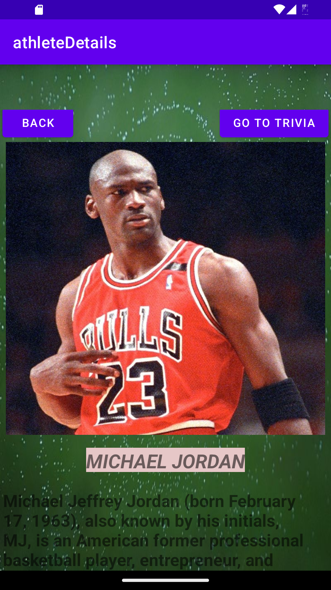
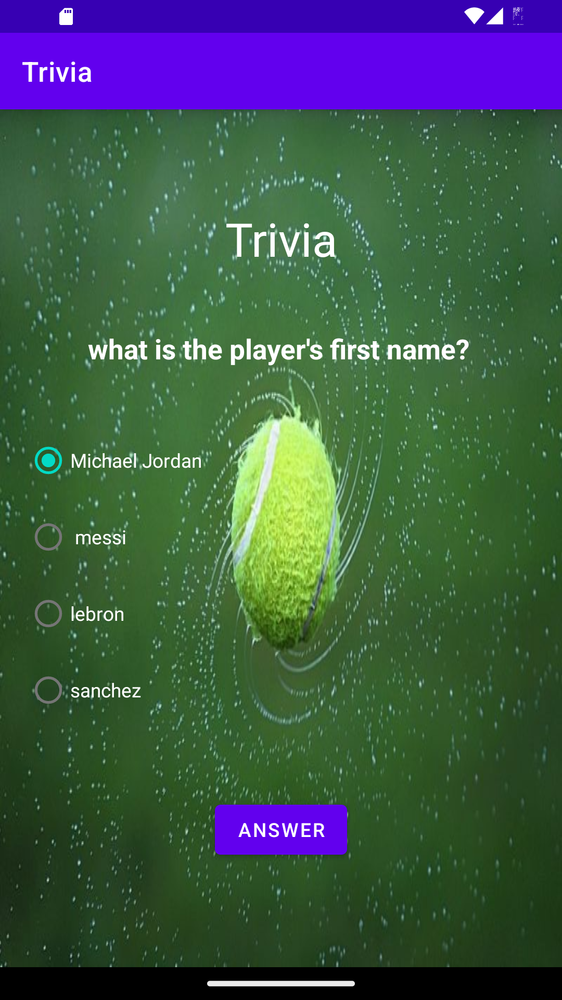
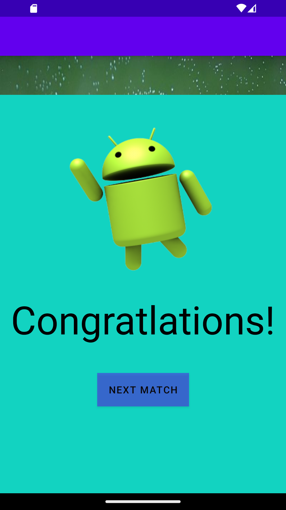
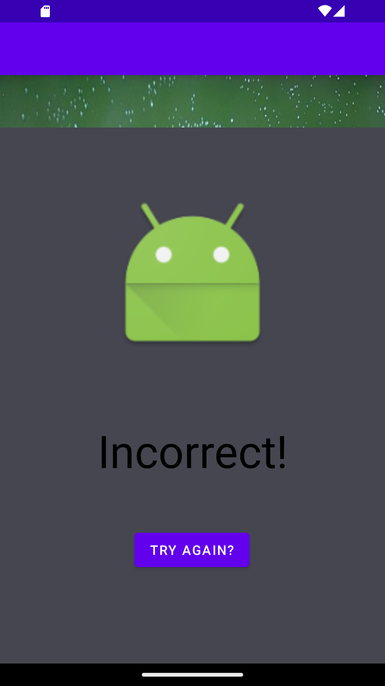
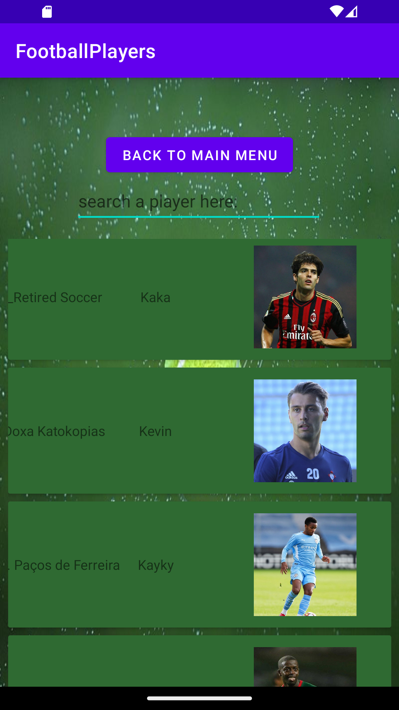

<h1>welcome to the  international sport web application:</h1>

 <h2>The project mission:</h2>
this application is designed to combine data and knowledge in sports.

<h2>seprated into multiple parts:</h2>

<h3>first part: </h3>
 displaying the athletes in 2 categories:
 ---all  athletes
 ---soccer athletes
 

<h3>second part: </h3>
 displaying the individual athlete.

<h3>third part:</h3>
trivia questions about the selected player/athlete.

<h3>features:</h3>
Fully written in Kotlin language. 
Built on MVVM architecture pattern. 
Uses Android Architecture Components, specifically ViewModel and LiveData. 
Uses Retrofit for making API calls. 
Uses Picasso for image loading. 
uses hilt for sharing components with the whole app. 
using coroutines to work Asynchronous. 
using room to create the database for the app. 
  

####

####

####

####

####

####

* Works offline by caching data into a database. 
* using Fragments in this app. 
* no need for api key in this app. 
* can search any player you want,learn and even do trivia on him.  

<h3>👏Acknowledgments</h3> 

* thanks for ThesportsDB for the api usage

